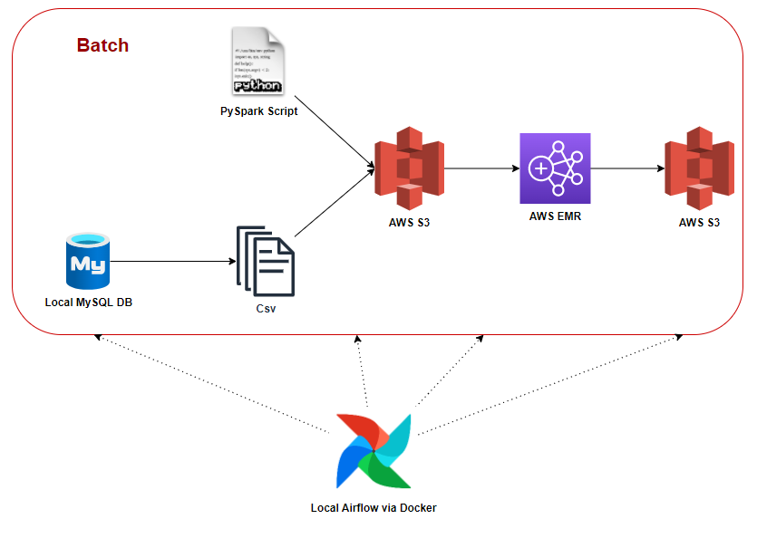

# Batch Data Processing with Airflow , Python and Spark (AWS EMR)

# Design




# Data

Insert the following csv into your sql

```bash
aws s3 cp s3://start-data-engg/data.zip ./
unzip data.zip
```

# Prerequisites

1. [docker] (With WSL2 as backend)
3. [AWS_account] (With AWS CLI configured) 
4. [MySQL] (Allow data export)


# Credit
This repository adpots technique from the following blog. 
[How to submit Spark jobs to EMR cluster from Airflow](http://startdataengineering.com/post/how-to-submit-spark-jobs-to-emr-cluster-from-airflow).